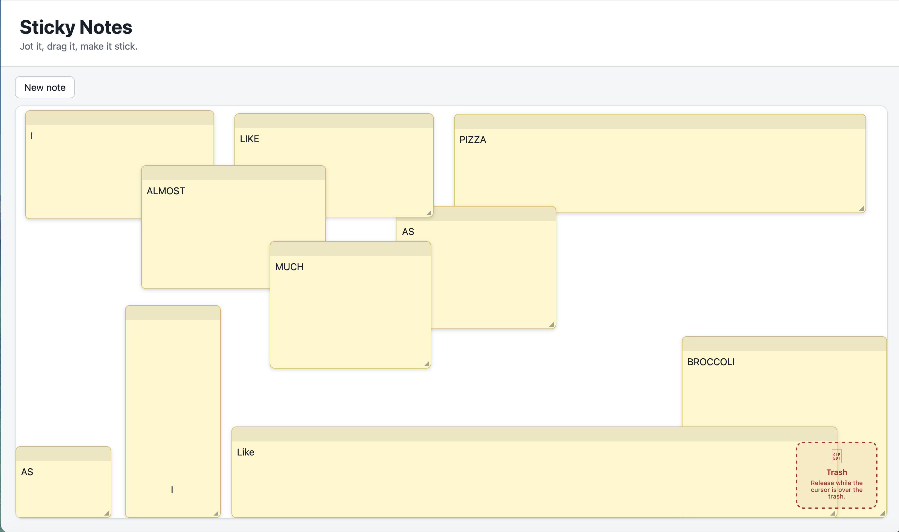

# Sticky Notes

A little desktop sticky-notes board built with React and TypeScript. You drag on the board to make a note, then move it, resize it, edit its text, and delete it with the × on a selected note.

I wrote the pointer handling straight against the Pointer Events API instead of reaching for a drag-and-drop library - the gesture handling felt like the actual point of the exercise, so hiding it behind a lib seemed like cheating.



## Running it

Use Node.js 24 LTS (or Node.js 22.13+ within the 22.x release line). Run these commands from the folder containing `package.json`:

```bash
npm install
npm run dev
```

If you installed dependencies using an older Node.js version, upgrade Node.js and run `npm install` again. npm can skip Vite's native Windows dependency when the Node.js version is unsupported, causing a "Cannot find native binding" error on startup.

`npm run check` is the one to run before pushing: type checker, ESLint, unit tests, production build.

## How it's put together

A few notes to future me:

- Committed note data is kept separate from the temporary gesture state. Notes are an ordered array behind a small pure reducer (`src/board/notes.ts`); array order _is_ the stacking order, so the last note in the array paints on top. The reducer hands back the same state object for no-op actions, which is what lets the memoised note components skip re-rendering, so don't tidy that into always returning a fresh object.
- There's a single coordinate system: the `boardSurface` element. Pointer math, previews, CSS positioning and the persisted rectangles are all measured against that one element, so there's nothing to convert between.
- Gesture handling lives in `src/board/useBoardGestures.ts` and uses pointer capture. The raw pointer position sits on a ref and `requestAnimationFrame` holds the preview to one update per frame. Final geometry comes from the `pointerup` coords, not the last rendered frame, because occasionally a frame is a beat behind and you don't want to commit that.
- Persistence is in `src/board/storage.ts` and it waits for hydration. On mount the board measures its surface, reads and validates the saved notes, clamps them into the current board, and only then starts saving. StrictMode double-fires that hydrate effect, which stomped the saved notes until I gated the save behind a ready phase. Stored values arrive as `unknown` and get validated before use.

## Stuff I'd fix with more time

- Notes don't reflow when you resize the window. They just get clamped the next time you touch them.
- No undo/redo, and no keyboard alternative to the drag gestures.
- Touch and pen behaviour is untested - I only really drove it with a mouse in Chrome.
